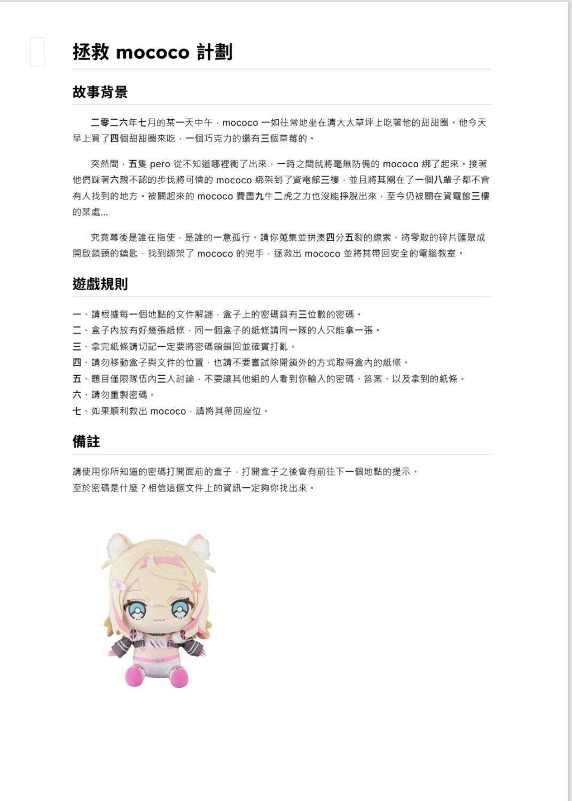
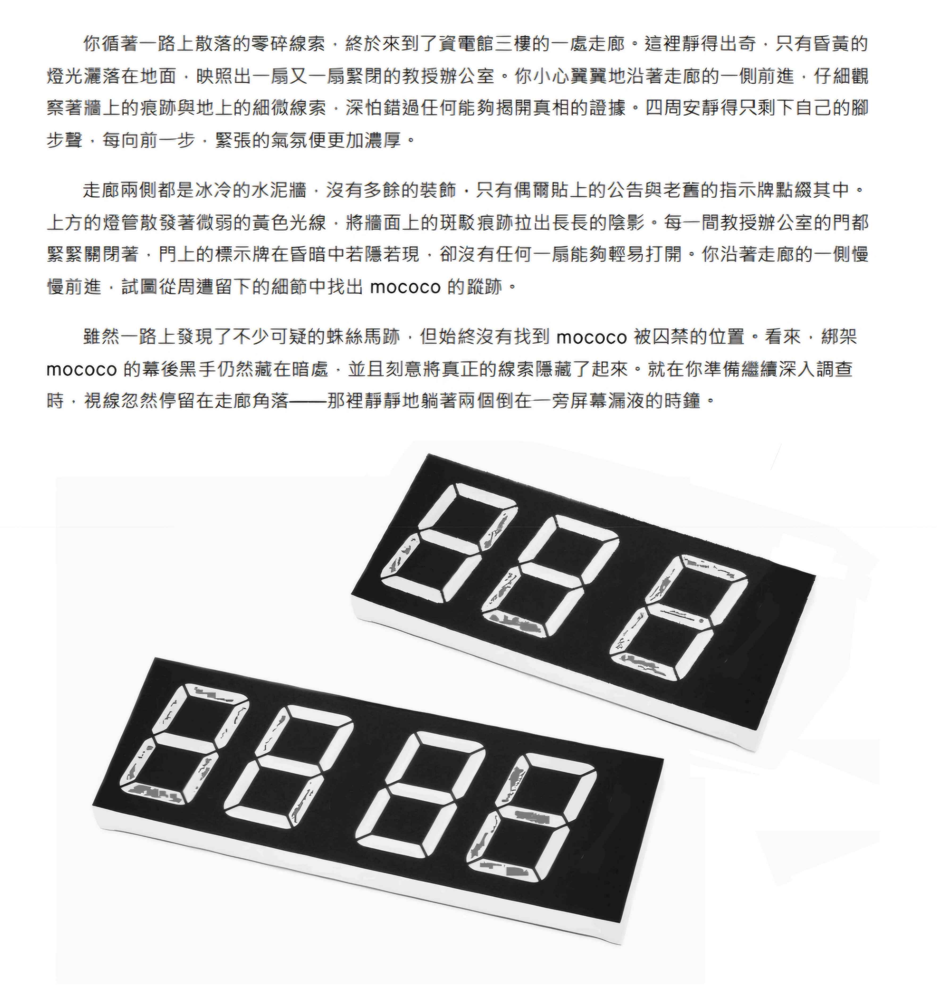
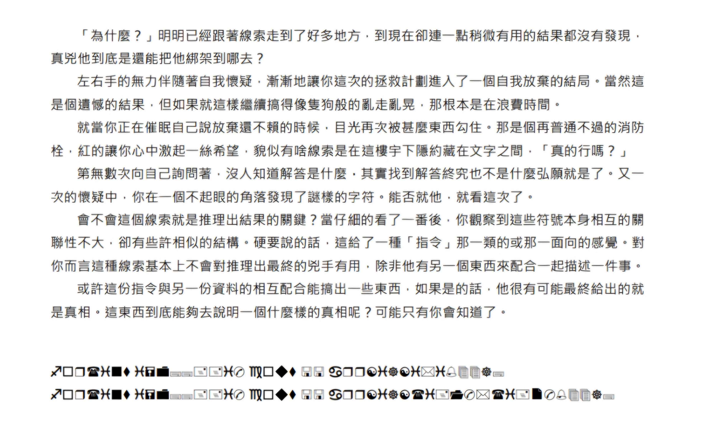

## 事出必有因

其實也沒什麼，那時候是看到葉子在discord的動態問說要不要去參加一個叫ionc的營隊，我上網查過之後才知道那是清大舉辦的一個競程營隊。競程這東西對我來說只能說是非常的陌生，雖然之前因為要玩遊戲有去查過尋路算法之類的東西，但我從來沒有一步一步好好的學過這東西，然後今天的文章大概不會聚焦在具體教了甚麼，因為這些東西要整理起來然後打出來好像有點累，看看之後有沒有機會再以筆記的形式發出來吧。

## 第一天的解謎

第一天晚上他們安排了一個比較輕鬆的比賽，有很多有趣的題目然後分組比賽，因為我那時候小組的分配是讓我從後面往前做，我就直接玩了最後一題很像大地遊戲的一個解謎題目，他總共有三個盒子和盒子的三把鎖，每個盒子的位置跟鎖的密碼都有一個謎題要你去解。

第一個盒子在桌子上然後只要把紙上有出現的數字加起來就好了其實沒有很難，我一開始就有用過這個解法，但是可能是數學太爛結果意外地在這題卡了很久。

第二個盒子在一個很陰間的地方，他藏在樓梯間走出來有一個很厚重的門上面，他的密碼又更簡單了，密碼提示紙上面有兩個七段顯示器，七段顯示器上面數字的地方有一點點的小汙漬，看得出來形成了兩個三位數，把這兩個三位數相減密碼就出來了，真的沒有很難所以我很快就解出來了，但是好像有一些人被上面的字給誤導了所以花了不少時間。

第三個盒子在工人休息室，我前面鋪陳這麼多其實只是為了要說這一題。這題真的很屌，他下面有wingdings編碼的兩段字，對照表的結果是 `for(int=0;;++i)cout<<arr[i][i*i%44d];` 跟 `for(int=0;;++i)cout<<arr[i][(i+1)*(i+2)%44];` 當看到這兩行的時候我們在解題的四個人看來看去也不知道這兩行是什麼，結果就在我們想破腦的時候，我們的[企鵝](https://pg72.tw/)通靈到了一行的字數剛好是44個字，就這樣我們幾個人把這大段文字轉成陣列之後把i從零開始代入那兩個函式，最後在結束前把通關密語跟作者說就拿到了這題的密碼。不過在結束前還有一個小插曲，就是因為那時候時間快到了，但是我們的flag還要上傳到oj上才可以，所以我們就用跑的回去，結果不知道為什麼教室的門是鎖的，我們一群人就趴在門上瘋狂敲門一邊大喊著快點開門，不過最後也是順利得拿到了這個一百分。

## 睡眠

因為整個活動是早上七點多起床一直到晚上十點多才會放我們回宿舍，所以睡眠就是一個很大的問題，我這個人如果沒有睡飽我上課就會一直處於一個，想睡但又不能倒頭就睡不然起來就會是下課的狀況，不過他們讓我們中午睡了一個小時，我下午起來再聽課的時候精神狀態變超好，只能說我之前完全沒發現午休這麼好用。

## 收穫

其實這次收穫最多的大概是那本厚到靠杯的講義，雖然有些東西還不太懂那個到底是什麼跟具體的實現，不過畢竟就這幾天還要教那些似乎也不太可能，所以我大概之後會好好把那本書再看過一遍。